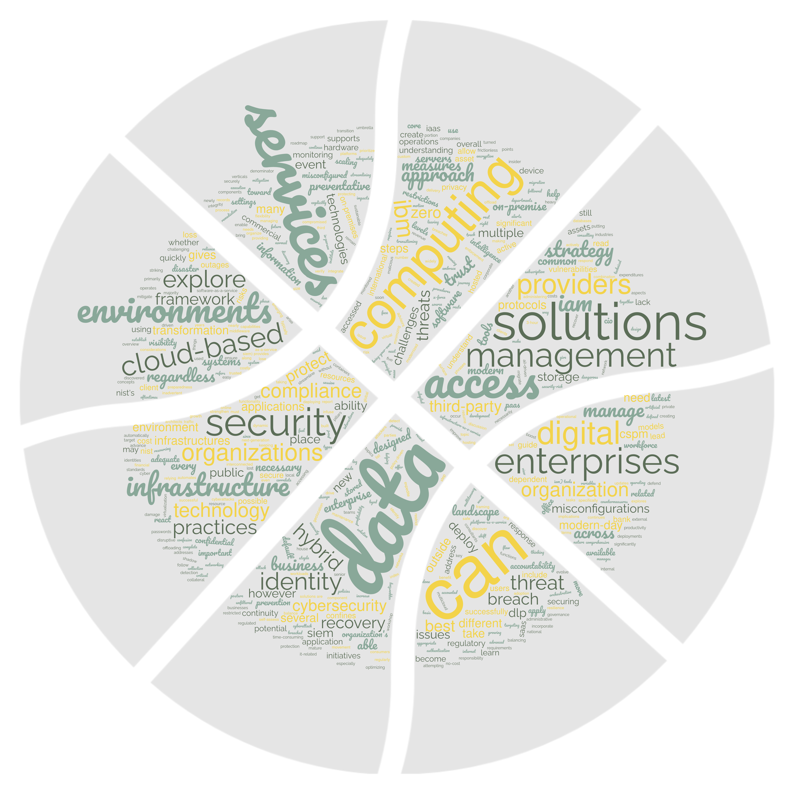
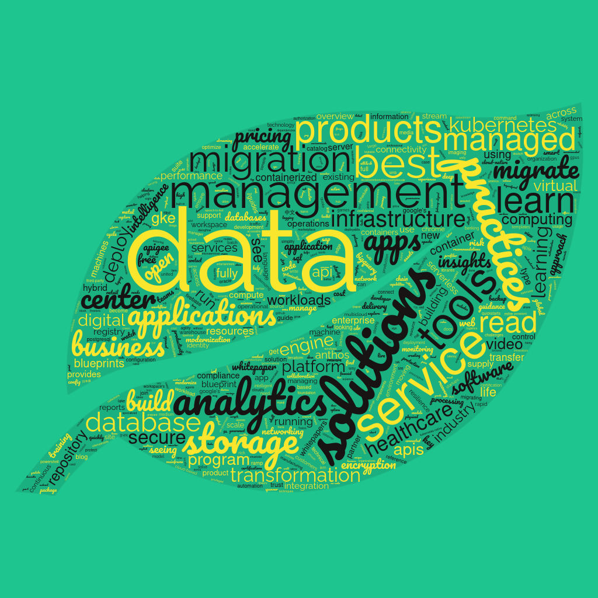
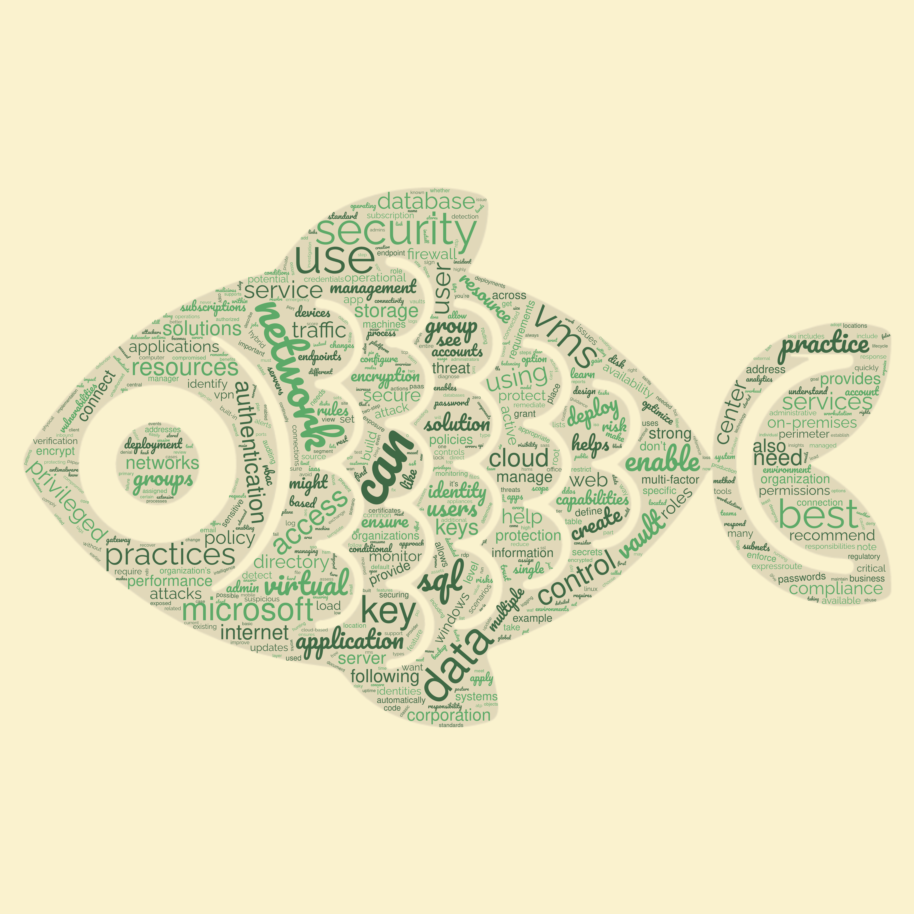

# Best Practices

> For whom?

Stakeholders decide what practices provide the best
return on investment for their user stories.  From
single user to mega-event, the technologies vary from
microcontroller to mainframe, the software from
assembler to high level language, and developer teams of
one to thousands distributed over the globe.  Given the
topic breadth, how presumptuous is it to even attempt a
discussion about best practices in a single page
document?

It is tempting to begin with a low level syntax
discussion, but which syntax? An alternative would be to
approach the topic top down with relevant patterns for
sub-topics such as:

 - Security
 - Durability
 - Resiliency
 - Deliver-ability
 - Test-ability
 - Dependency management
 - Documentation
 - Content Management
 - Traceability

They sound like buzz words, but consider adding "Is it"
to make a question out of the pattern, something
like "Is it secure?, Is it durable?" and so on, leading
to the next level of exploration.

Is it good practice not to waste time trying to do
something that has already been done successfully by
someone else?  There are so many successful organizations
with exceptionally smart people working and volunteering
for them, that adopting those organizational best
practices is the approach for the following discussions.

## Security

Let us look at the key security words from IBM Cloud, Google Cloud
Platform, Microsoft Azure, and Amazon Web Services and link directly to
each site.

### IBM

### Google

### Microsoft Azure

## Reference

1. [wordclouds.com](https://www.wordclouds.com/)
2. [GCP_security_wordlist](./assets/word_lists/google-security-wordcloud.csv)
3. [IBM_security_wordlist](./assets/word_lists/ibm-security-wordcloud.csv)
4. [Azure_security_wordlist](./assets/word_lists/microsoft-azure-wordcloud.csv)
